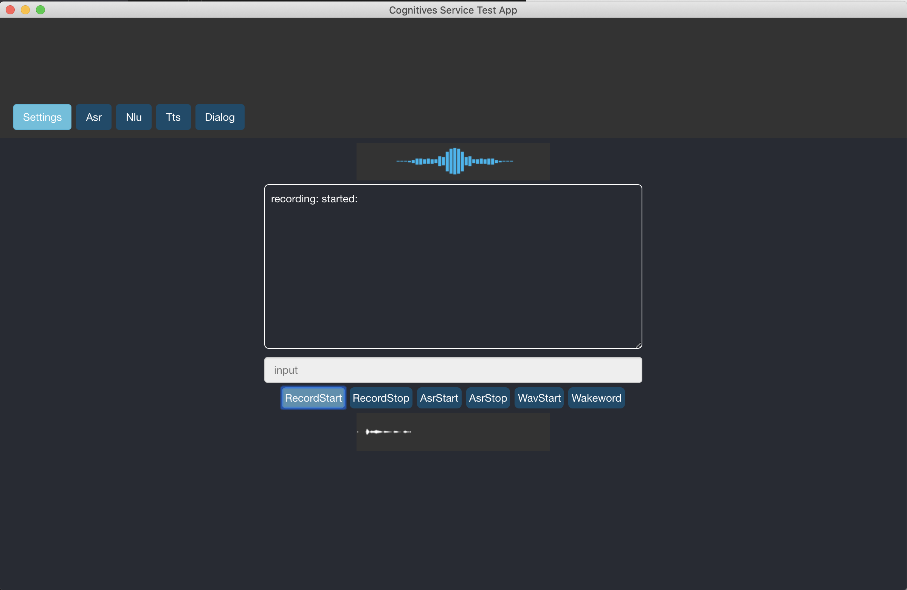

### cognitive-services-test-app

*cognitive-services-test-app* is an electron/typescript app for testing cognitive services.

Azure services are implemented via the cognitiveserviceslib module (https://github.com/wwlib/cognitiveserviceslib).



#### prerequisites
- install node (i.e. v8.12.0)
- install yarn

#### install & run
```
yarn
yarn build
yarn start
```

#### raspberry pi notes
cognitive-services-test-app runs nicely on a Raspberry Pi B 3+

Some tips:
- tested with a standard raspbian 9 (stretch)
- npm install -g electron@5
  - (tested with electron 5.0.13)
- see docs/rpi for example config files
  - ~/.asoundrc
  - /usr/share/alsa/alsa.conf
  - /lib/modprobe.d/aliases.conf
  - /boot/config.txt

Automatically launch with startx:

~/.xinitrc
```
electron [path-to-project]/cognitive-services-test-app/public/electron.js
```

### about electron & @craco/craco

**Medium post:**
<https://medium.com/@andrew.rapo/using-create-react-app-craco-to-build-apps-for-both-the-web-and-electron-8f4ab827877f>

This project was bootstrapped with [Create React App](https://github.com/facebook/create-react-app), like...

`create-react-app cognitive-services-test-app --typescript`

In this project the [\@craco/craco](https://www.npmjs.com/package/@craco/craco) module is used to override the create-react-app default webpack config instructing it to build for the `electron-renderer`. This allows the app to run in electron AND have access to the filesystem, etc. See: `craco.config.js`

```js
let target = 'web';
if (process.env.REACT_APP_MODE === 'electron') {
  target = 'electron-renderer'
}
console.log(`craco.config.js: setting webpack target to: ${target}`);

module.exports = {
    webpack: {
        configure: {
            target: target
        }
    }
};
```

#### environment variables

Environment variables are used at runtime to enable/disable features depending on what the browser or Electron supports.

.env.web
```
REACT_APP_NAME=myApp
REACT_APP_MODE=web
```

.env.electron
```
REACT_APP_NAME=myApp
REACT_APP_MODE=electron
```

at runtime...
```js
let fs: any;
if (process.env.REACT_APP_MODE == 'electron') {
    console.log(`REQUIRING fs-extra`);
    fs = require('fs-extra');
}

export default class TestFs {

    static getDirectoryListing(): string {
        if (process.env.REACT_APP_MODE == 'electron') {
            let files = fs.readdirSync('.');
            return JSON.stringify(files, null, 2);
        } else {
            return 'Directory listing is not available in the browser.'
        }
    }
}
```

#### web
To develop for the Web and automatically launch a browser window for development...

```
yarn start:web
```

To build for the Web...

```
yarn build:web
```

#### electron
To build for the electron, launch an electron window and reload electron automatically while developing...
```
yarn watch:electron
```
and in another console tab...
```
yarn start:electron-dev
```

**electron 5 compatibility**
- https://stackoverflow.com/questions/55093700/electron-5-0-0-uncaught-referenceerror-require-is-not-defined
- https://electronjs.org/docs/faq#i-can-not-use-jqueryrequirejsmeteorangularjs-in-electron
```
mainWindow = new BrowserWindow({width: 1024, height: 768});

change to:
mainWindow = new BrowserWindow({width: 1024, height: 768, webPreferences: { nodeIntegration: true }});

```

**electron 6 compatibility**
- https://github.com/electron/electron/blob/master/docs/api/breaking-changes.md
```
// Deprecated
require('fs')
// Replace with
require('electron').remote.require('fs')
```

#### electron-builder
To build a native application (i.e. for MacOS)...
```
yarn build:electron
yarn dist
```

Then launch the dmg found in the `dist` folder or open the app in `dist/mac`

#### electron & grpc
grpc will not work with webpack. So, craco.config.js excludes all node modules from the webpack build, including grpc. This makes the build much faster and is fine for the electron version.

grpc needs to be rebuilt for the current version of electron. This is best accomplished using electron-rebuild:
- https://www.npmjs.com/package/electron-rebuild
  - add a script: "rebuild": "electron-rebuild -f -w grpc"
  - npm run rebuild

Other grpc/electron notes (not needed):
- https://www.npmjs.com/package/grpc
- https://github.com/mixer/etcd3/issues/97
  - npm install grpc --runtime=electron --target=5.0.12
- https://github.com/grpc/grpc-node/issues/989
  - npm rebuild --runtime=electron --target=5.0.12
